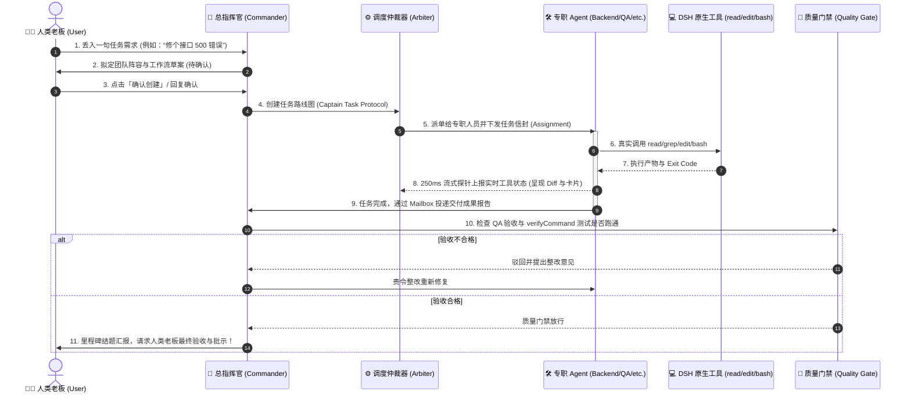

# 🍳 DSH Let Them Cook (DSH 开整天团)

<p align="center">
  
  
  
  
  
</p>

<p align="center">
  <b>Toss in the work, let them cook!</b><br/>
  <b>把活儿丢进群，放手让他们开整！</b><br/>
  专为 <b>DeepSeek Harness (DSH)</b> 原生打造的工作区级多 Agent 自治协同与闭环交付编排扩展。<br/>
  别再给单聊 AI 当全职保姆了！拒绝纯嘴炮虚假执行，拒绝机器人互拍马屁——让专业团队真正跑工具、敲代码、做质检，拿交付结果说话！
</p>

<p align="center">
  <a href="#-一句话说清核心价值-what-makes-it-cook">核心价值</a> •
  <a href="#-与-dsh-底座业务架构边界-architecture--boundaries">架构边界</a> •
  <a href="#-业务闭环流转全景-workflow-lifecycle">业务闭环</a> •
  <a href="#-硬核功能亮点-features">硬核亮点</a> •
  <a href="#-内置天团世界观-personas">天团世界观</a> •
  <a href="#-扩展安装部署指南-installation--deployment">安装部署</a> •
  <a href="#-质量保证与测试矩阵-quality--test-matrix">测试矩阵</a> •
  <a href="#-项目导航与开发宪章-navigation--agentsmd">开发宪章</a>
</p>

---

## 🍳 一句话说清核心价值 (What Makes It Cook?)

### 痛点：传统 AI 单聊 / 假多智能体的四大翻车现场
1. **“人工当保姆”**：你得一步步问、一步步催，写个功能得来回拷问几十次，稍微长一点的任务 AI 就突然失忆停摆；
2. **“嘴炮流干活”**：模型在对话框里信誓旦旦声称“我已为您读取了文件”、“我已跑通了单元测试”，一查后台实际上连工具权限都没有，纯靠幻觉胡说八道；
3. **“机器人自嗨”**：很多所谓的多智能体插件，一旦跑起来就是几个角色在群里互相拍马屁致谢（“感谢架构师”、“同意楼上观点”），Token 烧得飞起，产物一无所有；
4. **“暴力侵入宿主”**：动不动就劫持主界面，污染全局 DOM，搞得官方源版“对话”输入框都丢了，升级版本直接崩盘。

### 解法：DSH 开整天团的自治交付哲学
> **你只当老板负责喝咖啡与点头确认，剩下的脏活累活交给天团开整！**

- **老板只需丢一句话**：不用费心手搓角色 Prompt 或配置复杂工作流。中央群聊一句话丢出需求（例如：“修个页面溢出 Bug”、“为后端接入 Redis 缓存”、“做个发版前全面审计”）；
- **主控秒级出方案**：总指挥官（`commander`，如乔布斯/诸葛亮）秒级理解意图，生成量身定制的角色阵容与五阶段工作流草案，**得到你确认批准后，才真正动工作区配置**；
- **各领域专员各司其职，工具真刀真枪执行**：
  - 调研专员（马斯克）跑原生工具搜索与网页情报爬取；
  - 后端架构（黄仁勋）手搓 API 逻辑、修改代码、真机跑测试；
  - 前端开发（雷布斯）还原交互样式、精修组件；
  - 质量审计（比尔·盖茨）提大刀做红队测试、执行 Bash 验证命令；
  - 首席写手（张小龙）收口技术文档与 TODO。
- **官方同款工具状态机与代码 Diff**：每个工具调用都有独立卡片，毫秒级流式跳动。`edit` 自动计算 `+29 -14` 行号变动，`bash` 提取具体任务描述，退出码非零醒目标注 `失败` 标签；
- **全链路加密 Mailbox 与质检门禁**：SubAgent 完成任务后通过内部信箱向主控汇总，QA 验收未通过严禁强行推进，彻底保障交付质量；
- **人在回路主权在握**：遇到关键里程碑、架构技术选型或重大风险，总指挥官主动向你请示汇报，绝不在暗地里擅自自闭环！

---

## 🏗️ 与 DSH 底座业务架构边界 (Architecture & Boundaries)

本扩展作为 **Cordis 扩展模块** 深度集成于 DeepSeek Harness，遵循 **“零污染、零劫持、无感注入、安全避让”** 的顶级工程契约：

```text
┌──────────────────────────────────────────────────────────────────────────────────┐
│                        DeepSeek Harness (DSH) 官方底座宿主                        │
│                                                                                  │
│  ┌────────────────────────┐  ┌────────────────────────────────────────────────┐  │
│  │  官方源版「对话」视图   │  │  DSH 原生微内核与运行时服务 (Cordis Engine)    │  │
│  │  (Zero Hijacking 零劫持│  │  ├─ @deepseek-ai/dsh-tools 原生工具库          │  │
│  │   生命周期 100% 独立)  │  │  │  (read, edit, write, grep, glob, bash 等)   │  │
│  └────────────────────────┘  │  ├─ LLM 请求拦截管道 (Provider / Model 动态路由)│  │
│                              │  └─ Session 状态机与持久化事件流               │  │
│                              └───────────────────────┬────────────────────────┘  │
└──────────────────────────────────────────────────────┼───────────────────────────┘
                                                       │ 规范 Slot & Tool Scope 直通
                                                       ▼
┌──────────────────────────────────────────────────────────────────────────────────┐
│             🍳 DSH Let Them Cook (开整天团) 业务层 (@dsh-external/dsh-let-them-cook)     │
│                                                                                  │
│   【主舞台】conversation.view 插槽              【驾驶舱】shell.overlay 悬浮/停靠  │
│   ┌────────────────────────────────────┐       ┌───────────────────────────────┐ │
│   │    中央 Agent 群聊主阵地           │◄─────►│    开整天团工作台 (HUD)       │ │
│   │                                    │ 协同  │                               │ │
│   │ ├─ 老板丢任务：一键生成/确认草案    │ 状态  │ ├─ 路线图：Captain Task 路线  │ │
│   │ ├─ 专员争鸣：专职责边界与防死循环  │ 同步  │ ├─ 质检门禁：Stage DAG Quality│ │
│   │ ├─ 流式工具卡：Diff 行号/Bash 描述 │ (SSE) │ ├─ 共享黑板：Scratchpad 决策  │ │
│   │ ├─ 长文本渐进展开 (Gradient Mask)  │       │ └─ 消耗账本：Prompt Cache 命中│ │
│   │ └─ 常驻底部输入框：Searchable @Picker│       └───────────────────────────────┘ │
│   └────────────────────────────────────┘                                         │
│                              ▲                                                   │
│                              │ 250ms 事件探针 & Mailbox 上报                     │
│   ┌──────────────────────────┴────────────────────────────────────────────────┐  │
│   │    开整调度与防中断引擎 (Dispatch & Anti-Stall Engine)                     │  │
│   │    ├─ Universal Master Handoff：SubAgent 交付完毕强制回传主控收口         │  │
│   │    ├─ 双语推进识别引擎：智能识别“通过/准予/Approved/Proceed/LGTM”         │  │
│   │    ├─ 动态交互配额：快速任务 6~8 轮紧凑防发散，长工作流 24 轮充沛保障     │  │
│   │    ├─ 看门狗自愈机制：超时或异常自动向指挥官发报警信，由主控接管汇报      │  │
│   │    └─ 工作区级持久化：`.pm-workflow/dsh-group-chat/` 换项目绝对不串台     │  │
│   └───────────────────────────────────────────────────────────────────────────┘  │
└──────────────────────────────────────────────────────────────────────────────────┘
```

### 为什么我们敢说“绝不搞崩官方环境”？
1. **官方对话 100% 原汁原味**：离开本插件进入官方原生“对话”标签时，本插件的所有 DOM 容器、HUD 覆盖、样式劫持完全卸载，不留下任何脏数据或无效样式；
2. **绝对安全的 `prepare()` 契约**：在 `conversation.view` 插槽中暴露合规的生命周期适配层，无论官方 DSH 怎样热更新升级，都不会触发 `Cannot read properties of undefined (reading 'prepare')`；
3. **HUD 智能对称避让**：右侧 HUD 控制台只在当前插件激活时按需渲染；展开或拖拽缩放时仅调整群聊主界面的内部间距，绝不粗暴覆写全局 AppFrame 栅格。

---

## 🔄 业务闭环流转全景 (Workflow Lifecycle)

从你提出一个想法，到代码真正落地提交，天团内部全自动化流转：



---

## ✨ 硬核功能亮点 (Key Highlights)

### 1. 🧰 官方同款流式工具卡片 (Official-like Native Tool Rows)
不再是一个转圈的等待图标！在 SubAgent 执行工具时，中央群聊消息流中实时跳出官方同款动态卡片：
```text
Grep   120000
读取   src/index.ts
Bash   Add commander and writer to model-settings.json
编辑   src/engine/arbiter.ts   +29 -14
失败   Bash   npm test:matrix
```
- **代码行号 Diff**：自动比对 `edit` 前后行数，渲染 `+29 -14` 红绿药丸标签；
- **智能语义提取**：自动呈现操作文件路径，提取 Bash 任务真实意图，高亮检索关键词；
- **错误熔断机制**：发生非零退出码或异常时，显示醒目红底 `失败` 标签；
- **双层抽屉折叠**：每一行工具均可点击折叠/展开，查看完整的入参 (Input) 与产物 (Output)。

### 2. ⚡ 真正的 Prompt Caching 与真实消耗账本
对标官方 DSH 的底座计量与缓存规范：
- **全厂商缓存协议兼容**：兼容解析 DeepSeek 的 `prompt_cache_hit_tokens`、OpenAI 的 `prompt_tokens_details.cached_tokens` 与 Anthropic 的 `cache_read_input_tokens`；
- **拒绝虚假 0% 误导**：无缓存数据时优雅标明，真实命中共享团队宪章前缀时精准呈现：
  ```
  3 轮 · 8 步  LLM 4.2s · 工具调用 1.8s  首 token 平均 0.6s · 72 tok/s  缓存命中 68%  输入 12.4K tok · 输出 1.2K tok
  ```

### 3. 🛡️ 对话连贯性与防死锁引擎 (Anti-Stall Engine)
- **Universal Master Handoff**：任何专职角色交付完成后，若未显式 @ 其他专家，调度器强制回传给总指挥官，杜绝由于工作流未配审核人而造成的全局死锁；
- **看门狗超时自愈**：长任务耗时过长触发看门狗时，自动向主控投递报警信，唤醒主控介入降级模型或汇报人类；
- **动态自适应轮次**：长任务交互预算自适应扩容至 **24 轮**，保障五阶段闭环顺畅跑完。

### 4. 🌐 100% 全栈中英双语 (`zh-CN` / `en-US`)
- **HUD 标题栏一键切换**：点击标题栏 `中 / EN`，全界面秒级无感切换；
- **双语花名册与模糊 @ 唤醒**：输入 `@乔布斯`、`@jobs`、`@黄仁勋`、`@jensen` 均能精准识别；
- **双语导出纪要**：Markdown 纪要导出、工作流阶段报告均根据当前环境输出纯正中英文，绝无拼接硬编码。

---

## 🎭 天团世界观与内置主题 (Personas & Themes)

想要严肃交付？还是让科技巨头为你打工？或者干脆沙雕整活？一键随意切换：

| 主题标识 | 主题名号 | 调性定位 | 核心阵容（主控 / 调研 / 后端 / 前端 / 测试 / 文案） |
| :--- | :--- | :--- | :--- |
| **`legends`** | **科技传奇 (Tech Legends)** | 科技巨头来给老板打工，发布会级品味 | **乔布斯**（总指挥）• **马斯克**（调研）• **黄仁勋**（后端核显）• **雷布斯**（前端交互）• **比尔·盖茨**（红队QA）• **张小龙**（文案） |
| **`meme_comedy`** | **沙雕整活 (Meme Squad)** | 嘴碎但贼靠谱，甩锅防背锅，欢脱交付 | **离谱总导演** • **搜索侦探** • **搬砖硬汉** • **像素画师** • **找茬杠精** • **背锅文书** |
| **`modern`** | **现代精英 (Modern Elite)** | 严谨大厂工程架构，高规格交付 | **技术总监** • **业务调研员** • **后端架构师** • **前端开发** • **质量总监** • **技术文档官** |
| **`three_kingdoms`**| **三国风云 (Three Kingdoms)** | 军令如山，运筹帷幄 | **诸葛孔明**（主帅）• **水镜先生**（斥候）• **关云长**（先锋）• **周公瑾**（都督）• **魏文长**（断后）• **陈孔璋**（军师祭酒） |
| **`genshin`** | **原神提瓦特 (Teyvat Guild)** | 冒险家协会，清剿委托 | **琴团长** • **丽莎** • **钟离** • **妮露** • **胡桃** • **派蒙** |

---

## 📦 扩展安装部署指南 (Installation & Deployment)

无论你是要在日常使用的 DSH Web 客户端中直接安装，还是进行二次开发，请参考以下详尽步骤：

### 1. 环境依赖要求
- **Node.js**: `>= 18.0.0` (推荐 Node 20 LTS 或 Node 22)
- **DeepSeek Harness (DSH)**: 已安装官方 `@deepseek-ai/dsh` 环境
- **包管理器**: `npm` / `pnpm`

---

### 2. 源码克隆与制品编译
```bash
# 1. 克隆本项目仓库
git clone https://github.com/walke2019/DSH-Let-Them-Cook.git
cd DSH-Let-Them-Cook

# 2. 安装项目依赖
npm install

# 3. 运行 TypeScript 类型检查
npm run typecheck

# 4. 同时编译 Host 后端制品 (tsc) 与 Client 前端制品 (tsdown)
npm run build:all
```
编译完成后，会在项目根目录下生成 `lib/` 目录：
- `lib/index.js`：Cordis 后端服务入口与微内核插件定义；
- `lib/client.js`：经过 Tree-shaking 优化的 React 19 前端 Bundle；
- `lib/types/`：完整的 TypeScript 类型声明。

---

### 3. 部署与接入官方 DSH

#### 方式 A：标准配置文件接入（推荐，最简便）
官方 DSH 采用 Cordis Profile 加载机制。编辑用户目录下的配置文件：
- **macOS / Linux**: `~/.dsh/profiles/web/cordis.patch.yml`
- **Windows**: `%USERPROFILE%\.dsh\profiles\web\cordis.patch.yml`

在文件中追加插件加载项：
```yaml
# 在 profile patch 中挂载本插件
- insert:
    - id: group-chat
      name: '@dsh-external/dsh-let-them-cook'
```

如果采用本地软链开发，可以在该目录下创建 npm link 或全局模块连接：
```bash
# 在 DSH-Let-Them-Cook 根目录下执行
npm link

# 检查当前 DSH profile 环境中的 node_modules 是否已建立链接
```

#### 方式 B：通过 `dsh-super-injector` 无感热重载接入
如果你部署了扩展注入器工具：
```bash
# 1. 注入或更新插件包路径
dev_install_package --dir "/绝对路径/DSH-Let-Them-Cook"

# 2. 触发零停机热重载
dev_reload_package --packageName "dsh-let-them-cook"
```

---

### 4. 启动 DSH Web 并开始体验
在终端执行官方启动命令：
```bash
npx -y @deepseek-ai/dsh web --no-open
```
终端会输出如下所示的带认证 Token 的本地服务链接：
```text
[dsh web] listening on http://127.0.0.1:3080/?token=8a7b9c...
```
**在浏览器中打开该完整 URL**：
1. 页面中央顶部会多出一个专属的 **`Agent 群聊`** 标签，点击即可进入天团主阵地；
2. 页面右侧将出现可折叠、可拖拽缩放的 **`开整天团工作台 (HUD)`**；
3. 如果是在左侧开启的新建空白会话（Blank Hero），页面上会出现“💬 进入 Agent 群聊”的快捷入口，点击即可一键唤醒！

---

### 5. 常见部署排错避坑 (Troubleshooting)

| 现象 | 可能原因 | 解决办法 |
| :--- | :--- | :--- |
| 打开页面提示 `dsh web authentication required` | 打开了裸 `http://127.0.0.1:3080/`，缺少 URL Token 鉴权参数 | 重新从 DSH 启动终端中复制带 `?token=...` 的完整链接并在浏览器中打开 |
| 控制台报 `Cannot read properties of undefined (reading 'prepare')` | 使用了过时的历史旧插件，破坏了 DSH `conversation.view` 契约 | 确保运行了最新的 `npm run build:all`，本插件自带稳定的 `prepare()` 适配器 |
| 修改前端 React 代码后页面没有变化 | 未重新生成 `lib/client.js` 前端制品 | 执行 `npm run build:client`（约 30ms），然后在浏览器中按 `Cmd + R` 或 `F5` 刷新页面 |
| 端口冲突 `EADDRINUSE: 3080` | 上一个 DSH 进程未完全退出 | 检查并结束残留的 node 进程（如 `lsof -i :3080`），然后重新启动 |

---

## 🧪 质量保证与测试矩阵 (Quality & Test Matrix)

本项目设立了覆盖全链路的 **50 项严格自动化回归与集成测试矩阵**，发布前必须全数通过：

```bash
# 执行完整测试矩阵（涵盖工具白名单、DAG 状态机、Prompt 缓存、多语言与防死锁）
npm run test:matrix

# 生产级发布预检
npm run preflight
```

---

## 📂 项目导航与开发宪章 (Navigation & AGENTS.md)

为了保证本项目的代码质量和长期架构纯洁性，项目严格划分了三大文档定位：

- **[`README.md`](./README.md)**（当前文件）：面向所有使用者的业务定位、核心价值、架构边界图与安装部署总览；
- **[`AGENTS.md`](./AGENTS.md)**：**所有参与本项目开发/维护的 AI Coding Agent 的工程宪法与避坑指南**！
  - 严禁破坏 DSH 微内核，严禁劫持官方源版对话；
  - 包含原生工具白名单映射、流式工具探针对齐、Prompt 缓存解析、工作流防中断引擎等 **30 条铁律与避坑指南**；
  - 内附 **核心规范与避坑专项文档映射表 (Norm-to-Docs Matrix)**，可直接跳转对应的底层设计；
- **[`/Docs`](./Docs/README.md)**：收录了从 P1 到 P88 的所有技术方案设计、踩坑剖析与演进历史索引（详见 [Docs/README.md](./Docs/README.md)）。

---

## 📄 开源许可证 (License)

本项目采用 [MIT License](LICENSE) 授权开源。<br/>
**把活儿丢进群，放手让他们开整！** 🍳
