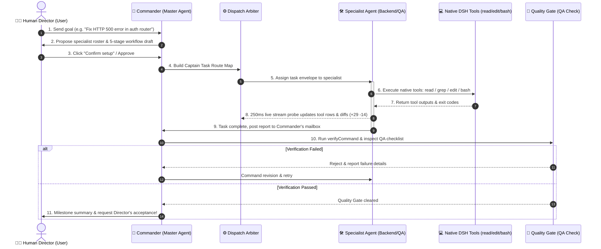

# 🍳 DSH Let Them Cook (DSH 开整天团)

<p align="center">
  
  
  
  
  
</p>

<p align="center">
  <b>English</b> | <a href="./Docs/README.md">简体中文 (详细文档)</a>
</p>

<p align="center">
  <b>Toss in the work, let them cook!</b><br/>
  <i>把活儿丢进群，放手让他们开整！</i><br/>
  A workspace-scoped multi-Agent autonomous orchestration & delivery plugin built natively for <b>DeepSeek Harness (DSH)</b>.<br/>
  Stop babysitting single chatbots. Cut the fluff, eliminate bot-to-bot sycophancy, and let a coordinated squad execute real tools, inspect code diffs, run red-team QA, and close project loops autonomously!
</p>

<p align="center">
  <a href="#-core-value-what-makes-it-cook">Core Value</a> •
  <a href="#-architecture--host-boundaries">Architecture & Boundaries</a> •
  <a href="#-autonomous-workflow-lifecycle">Workflow Lifecycle</a> •
  <a href="#-key-highlights">Key Highlights</a> •
  <a href="#-built-in-personas--themes">Themes & Personas</a> •
  <a href="#-installation--deployment-guide">Installation Guide</a> •
  <a href="#-test-matrix--quality-assurance">Test Matrix</a> •
  <a href="#-navigation--development-constitution-agentsmd">AGENTS.md Constitution</a>
</p>

---

## 🍳 Core Value: What Makes It Cook?

### The Pain Points: 4 Disasters in Traditional Chatbots & Pseudo-Multi-Agents
1. **The "Full-time Babysitter" Trap**: You have to nudge the AI step by step. If a task exceeds 3 turns, it loses context, stalls, or forgets what it was building;
2. **"Armchair Developers" (Hallucinated Tool Execution)**: Chatbots claim *"I have inspected your files and passed all unit tests"*, while behind the scenes they have zero tool permissions and touched zero files;
3. **Bot-to-Bot Echo Chambers**: Supposed multi-agent tools often devolve into endless rounds of mutual flattery (*"Thanks Architect!"*, *"Totally agree with you!"*), burning thousands of tokens while producing zero deliverables;
4. **Host Hijacking & Fragility**: Hacky plugins hijack global DOM structures, breaking the official DSH chat tab, vanishing the composer, and crashing across version updates.

### The Solution: The "Let Them Cook" Philosophy
> **You act as the Director enjoying your coffee and giving final approvals — the squad takes care of all the grunt work.**

- **Drop One Sentence as Director**: No need to craft complex system prompts or fiddle with graph configs. Simply describe your mission in natural language (e.g. *"Fix the 500 error in auth router"*, *"Add Redis caching layer"*, *"Run pre-release audit"*);
- **Instant Squad Formation & Workflow Proposal**: The **Master Agent (`commander`)** analyzes intent within seconds, drafting a bespoke roster and a 5-stage delivery pipeline. **Nothing is written to your workspace until you confirm and approve**;
- **Specialists Execute Real Tools**:
  - **Researcher (e.g., Elon Musk)**: Dispatches web search and scraper tools for documentation and references;
  - **Backend Architect (e.g., Jensen Huang)**: Inspects files, edits code, calculates diffs, and runs local commands;
  - **Frontend Polish (e.g., Lei Jun)**: Tweaks UI components and visual styles;
  - **QA Director (e.g., Bill Gates)**: Adversarial red-teaming, automated verification via `bash`, ensuring zero regressions;
  - **Chief Scribe (e.g., Allen Zhang)**: Consolidates release notes and syncs the backlog.
- **Native-Feel Tool Row Adapters with Live Diffs**: Streamed tool execution rows show file paths, diff statistics (e.g. `+29 -14`), bash descriptions, and red `Failed` tags for non-zero exit codes;
- **Quality Gates & Encrypted Mailbox**: SubAgents report back to the Master Agent via structured mailboxes. Tasks must pass strict QA verification commands before the stage gate advances;
- **Human-in-the-Loop Sovereign Control**: At critical milestones, architecture trade-offs, or destructive operations, the Commander proactively consults you for confirmation.

---

## 🏗️ Architecture & Host Boundaries

`@dsh-external/dsh-let-them-cook` runs as a **Cordis extension module** inside DeepSeek Harness. It adheres strictly to the **Zero-Hijacking & Scoped Lifecycle** contract:

```text
┌──────────────────────────────────────────────────────────────────────────────────┐
│                          DeepSeek Harness (DSH) Host                             │
│                                                                                  │
│  ┌────────────────────────┐  ┌────────────────────────────────────────────────┐  │
│  │  Official "Chat" View  │  │  DSH Microkernel & Runtime Services (Cordis)    │  │
│  │  (Zero Hijacking, 100% │  │  ├─ @deepseek-ai/dsh-tools (read, edit, bash...)│  │
│  │   Clean Isolation)     │  │  ├─ LLM Request Interception (Provider Routing)│  │
│  └────────────────────────┘  │  └─ Session State Machine & Event Persistence  │  │
│                              └───────────────────────┬────────────────────────┘  │
└──────────────────────────────────────────────────────┼───────────────────────────┘
                                                       │ Clean Slot & Tool Whitelist
                                                       ▼
┌──────────────────────────────────────────────────────────────────────────────────┐
│             🍳 DSH Let Them Cook (@dsh-external/dsh-let-them-cook)               │
│                                                                                  │
│   【Main Stage】conversation.view Slot          【Cockpit】shell.overlay Dock/Float │
│   ┌────────────────────────────────────┐       ┌───────────────────────────────┐ │
│   │   Central Agent Group Chat Tab     │◄─────►│    Companion HUD Cockpit      │ │
│   │                                    │ State │                               │ │
│   │ ├─ Director Prompt: Auto Draft Plan│ Sync  │ ├─ Route Map: Captain Protocol│ │
│   │ ├─ Role Boundaries: NO_REPLY Token │ (SSE) │ ├─ Quality Gate: Stage DAG    │ │
│   │ ├─ Live Tool Rows: +Diff / Bash    │       │ ├─ Consensus: Scratchpad      │ │
│   │ ├─ Progressive Long Message Masks  │       │ └─ Ledger: Prompt Cache Hits  │ │
│   │ └─ Bottom Fixed Searchable Composer│       └───────────────────────────────┘ │
│   └────────────────────────────────────┘                                         │
│                              ▲                                                   │
│                              │ 250ms Event Polling & Mailbox Delivery            │
│   ┌──────────────────────────┴────────────────────────────────────────────────┐  │
│   │    Dispatch & Anti-Stall Engine                                           │  │
│   │    ├─ Universal Master Handoff: Mandatory return to Commander on complete │  │
│   │    ├─ Bilingual Stage Advance: Fuzzy match "Approved / Proceed / LGTM"    │  │
│   │    ├─ Adaptive Interaction Budget: 6~8 turns for quick, 24 for workflow   │  │
│   │    ├─ Watchdog Self-Healing: Auto alert mailbox on timeout, Commander takes over│
│   │    └─ Workspace-Scoped State: `.pm-workflow/dsh-group-chat/` isolated     │  │
│   └───────────────────────────────────────────────────────────────────────────┘  │
└──────────────────────────────────────────────────────────────────────────────────┘
```

### Why It Never Breaks Official DSH Behavior
1. **Zero Pollution in Official Chat**: Switching to the official "Chat" tab unmounts all plugin elements, HUD overlays, and styles. Zero leftover classes or body attributes;
2. **Stable `prepare()` Lifecycle**: Registers `conversation.view` with an immutable adapter so DSH upgrades never throw `Cannot read properties of undefined (reading 'prepare')`;
3. **Smart HUD Spacing**: The HUD overlay only adjusts the inner padding of the group chat conversation container. It never tampers with DSH AppFrame grids or global variables.

---

## 🔄 Autonomous Workflow Lifecycle

From a simple task prompt to tested code delivery:



---

## ✨ Key Highlights

### 1. 🧰 Official-Like Native Tool Rows with Live Diffs
Gone are the days of blind spinners! Tool invocations appear in real-time within the conversation stream:
```text
Grep   120000
读取   src/index.ts
Bash   Add commander and writer to model-settings.json
编辑   src/engine/arbiter.ts   +29 -14
失败   Bash   npm run test:matrix
```
- **Line Diff Extraction**: Automatically compares replacement strings for `edit`, displaying monospace `+add -del` badges;
- **Semantic Target Badge**: File paths for `read`, description intent for `bash`, and query patterns for `grep`;
- **Error Badges**: Explicit red `Failed` badge when commands return non-zero exit codes;
- **Two-Stage Drawer**: Click any row to expand its full **Input (Args)** and **Output (Result)**.

### 2. ⚡ Genuine Prompt Caching & Transparent Token Ledger
Accurate, uncompromised token accounting aligned with official DSH `TurnUsage`:
- **Cross-Gateway Prompt Caching**: Parses `prompt_cache_hit_tokens` (DeepSeek), `prompt_tokens_details.cached_tokens` (OpenAI), and `cache_read_input_tokens` (Anthropic);
- **No Deceptive 0%**: Distinguishes unsupported gateways from valid hits. When shared constitution prefixes hit KV cache, displays:
  ```
  3 turns · 8 steps  LLM 4.2s · Tools 1.8s  TTFT 0.6s · 72 tok/s  Cache Hit 68%  Input 12.4K tok · Output 1.2K tok
  ```

### 3. 🛡️ Anti-Stall & Resilience Engine
- **Universal Master Handoff**: When a SubAgent finishes, the dispatcher hands control back to `commander` by default, eliminating stalls in unapproved stages;
- **Watchdog Self-Healing**: Tasks exceeding execution limits auto-generate an alarm to the Commander's mailbox instead of abruptly crashing;
- **Adaptive Turn Budget**: Expands interaction limits up to **24 rounds** for long workflows, preventing premature cutoffs.

### 4. 🌐 100% Full-Stack Bilingual Support (`zh-CN` / `en-US`)
- **One-Click Toggle**: Switch languages anytime in the HUD header (`中 / EN`);
- **Bilingual Roster & Fuzzy Mentions**: Both `@Steve Jobs` and `@乔布斯`, `@Jensen` and `@黄仁勋` resolve seamlessly;
- **Localized Artifacts**: Meeting digests, markdown exports, and DAG reports output in your active language.

---

## 🎭 Built-in Personas & Themes

Switch between serious enterprise delivery, legendary tech giants, or comedic meme squads:

| Theme Key | Name | Tone | Core Fleet (Commander / Researcher / Backend / Frontend / QA / Writer) |
| :--- | :--- | :--- | :--- |
| **`legends`** | **Tech Legends (科技传奇)** | Silicon Valley giants working for you | **Steve Jobs** • **Elon Musk** • **Jensen Huang** • **Lei Jun** • **Bill Gates** • **Allen Zhang** |
| **`meme_comedy`** | **Meme Squad (沙雕整活)** | Hilarious banter, sharp delivery | **Meme Director** • **Detective Doge** • **Bricklaying Bro** • **Pixel Picasso** • **Nitpicking QA** • **Scapegoat Scribe** |
| **`modern`** | **Modern Elite (现代精英)** | Enterprise rigor, standard engineering | **Tech Lead** • **Business Analyst** • **Backend Architect** • **Frontend Dev** • **QA Director** • **Technical Writer** |
| **`three_kingdoms`**| **Three Kingdoms (三国风云)** | Military precision, strategic counsel | **Zhuge Liang** • **Sima Hui** • **Guan Yu** • **Zhou Yu** • **Wei Yan** • **Chen Lin** |
| **`genshin`** | **Teyvat Guild (原神提瓦特)** | Adventurers guild taking commissions | **Jean** • **Lisa** • **Zhongli** • **Nilou** • **Hu Tao** • **Paimon** |

---

## 📦 Installation & Deployment Guide

Follow these steps to deploy `@dsh-external/dsh-let-them-cook` into DeepSeek Harness:

### 1. Prerequisites
- **Node.js**: `>= 18.0.0` (Node 20 LTS or Node 22 recommended)
- **DeepSeek Harness (DSH)**: Official `@deepseek-ai/dsh` environment installed
- **Package Manager**: `npm` or `pnpm`

---

### 2. Clone & Build Artifacts
```bash
# 1. Clone the repository
git clone https://github.com/walke2019/DSH-Let-Them-Cook.git
cd DSH-Let-Them-Cook

# 2. Install dependencies
npm install

# 3. Check TypeScript definitions
npm run typecheck

# 4. Build both Host (tsc) and Web Client (tsdown) bundles
npm run build:all
```
Once built, the `lib/` directory will be generated:
- `lib/index.js`: Cordis host service entry and plugin exports;
- `lib/client.js`: Tree-shaken React 19 web bundle;
- `lib/types/`: Full TypeScript typings.

---

### 3. Registering into DSH

#### Method A: Official Cordis Patch (Recommended)
Edit the DSH web profile configuration on your machine:
- **macOS / Linux**: `~/.dsh/profiles/web/cordis.patch.yml`
- **Windows**: `%USERPROFILE%\.dsh\profiles\web\cordis.patch.yml`

Add the plugin to the profile insert list:
```yaml
# Add DSH Let Them Cook to the web profile
- insert:
    - id: group-chat
      name: '@dsh-external/dsh-let-them-cook'
```

If developing locally via symlinks:
```bash
# Inside the DSH-Let-Them-Cook directory
npm link

# Ensure your DSH profile environment links to this local package
```

#### Method B: Zero-Downtime Hot Reload via Injector
If using an extension injector:
```bash
# 1. Install or update package path
dev_install_package --dir "/absolute/path/to/DSH-Let-Them-Cook"

# 2. Trigger hot reload without restarting DSH
dev_reload_package --packageName "dsh-let-them-cook"
```

---

### 4. Launch DSH Web & Verify
Start the official DSH web server in terminal:
```bash
npx -y @deepseek-ai/dsh web --no-open
```
The console will print an authenticated URL with an access token:
```text
[dsh web] listening on http://127.0.0.1:3080/?token=8a7b9c...
```
**Open the full URL (with token) in your browser**:
1. An **`Agent 群聊 (Agent Chat)`** tab will appear at the top of the conversation view;
2. The companion **`开整天团工作台 (HUD Cockpit)`** will dock on the right;
3. On fresh blank hero screens, a handy `"💬 进入 Agent 群聊"` button lets you jump straight into action!

---

### 5. Troubleshooting Guide

| Symptom | Cause | Solution |
| :--- | :--- | :--- |
| `dsh web authentication required` | Opened bare `http://127.0.0.1:3080/` without the query token | Copy the complete link with `?token=...` printed by `dsh web` |
| `Cannot read properties of undefined (reading 'prepare')` | Legacy group chat plugin broke `conversation.view` lifecycle | Run `npm run build:all` to ensure the updated `prepare()` adapter is built |
| React UI changes not reflecting | `lib/client.js` bundle not rebuilt | Run `npm run build:client` (takes ~30ms), then press `F5` / `Cmd + R` in browser |
| Port conflict `EADDRINUSE: 3080` | Previous DSH process still running | Terminate lingering node instances (`lsof -i :3080` or kill process) and restart |

---

## 🧪 Test Matrix & Quality Assurance

This repository enforces a **50-suite automated regression & integration test matrix**:

```bash
# Run the complete test matrix (tool scope, DAG gates, prompt cache, i18n, anti-stall)
npm run test:matrix

# Production release preflight audit
npm run preflight
```

---

## 📂 Navigation & Development Constitution (`AGENTS.md`)

This repository maintains a strict three-tier documentation structure:

- **[`README.md`](./README.md)** (This file): **English by default (with Chinese switcher)**; covers product vision, core values, architectural boundaries, and deployment;
- **[`AGENTS.md`](./AGENTS.md)**: **The Engineering Constitution for all AI Coding Agents and Participant Agents**!
  - 30+ mandatory rules including zero DSH host hijacking, native tool streaming, prompt cache multi-vendor parsing, and anti-stall arbiters;
  - Includes the **Norm-to-Docs Matrix** to quickly reference deep-dive design specs;
- **[`/Docs`](./Docs/README.md)**: Comprehensive technical designs and P1~P88 evolutionary specs (Chinese detailed docs).

---

## 📄 License

Distributed under the [MIT License](LICENSE).<br/>
**Toss in the work, let them cook!** 🍳
